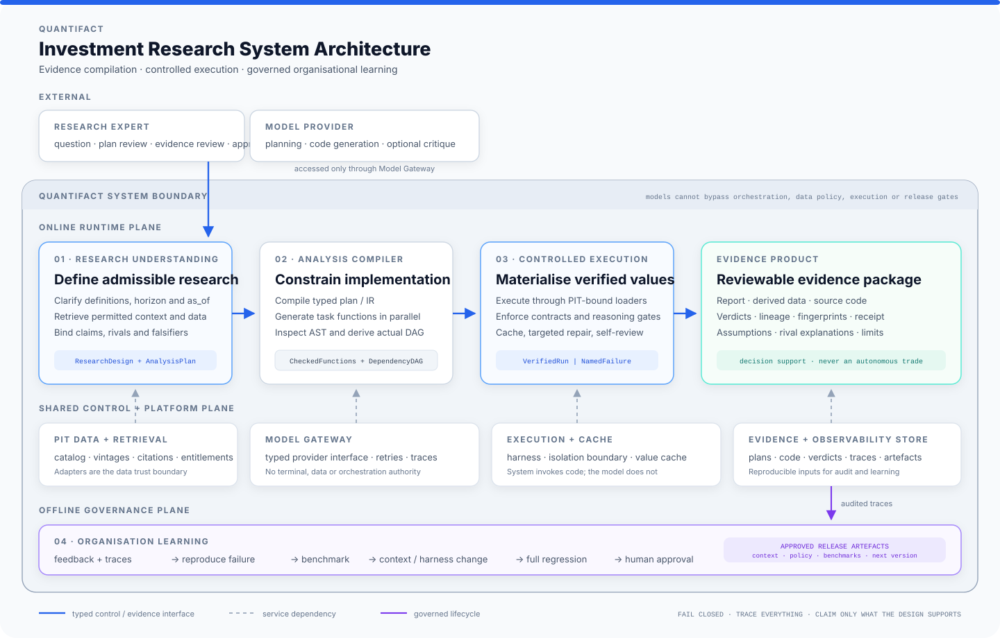

# Architecture: containing error in investment research

Quantifact is designed around one investment-research problem: a model can
produce a plausible analysis long before the question, data, implementation or
inference is fit for use. The architecture therefore reduces the model's error
space at explicit boundaries instead of relying on a larger prompt or a second
model's approval. Each subsystem owns one irreversible hand-off and emits a
reviewable artefact.

## 1. Research understanding

**Input:** user question, identity, entitlements and knowledge date.

**Owns:** clarification, document and series search, concrete data binding,
workflow selection, and the pre-registered critical-thinking contract.

**Output:** `ResearchDesign + AnalysisPlan`.

It must not write or execute analysis code. A future chat service may add
persistence, cancellation and continuation without changing this hand-off.

## 2. Analysis compiler

**Input:** the reviewed research design and typed plan.

**Owns:** plan compilation, parallel task code generation, AST checks, and the
cross-check between declared and actual dependencies.

**Output:** checked task functions plus the actual DAG.

The model is a replaceable backend inside this subsystem. It does not choose
whether compilation or static analysis runs.

## 3. Controlled execution

**Input:** checked functions, DAG, point-in-time adapter and knowledge date.

**Owns:** loader binding, cache identity, layered materialisation, result
contracts, targeted repair, self-review, report, receipt and governed writeback.

**Output:** a reviewable evidence package or a named, blocking failure.

The current restricted Python namespace reduces blast radius but is not a
production sandbox. A container or VM remains required for untrusted models.

## 4. Organisation learning

**Input:** an expert correction or a missed failure from a completed run.

**Owns:** failure reproduction, benchmark creation, candidate workflow/planner/
contract changes, full regression, and preparation for human review.

**Output:** a versioned lesson and benchmark; never an automatically merged
runtime mutation.

This is intentionally off the success path. Ordinary runs do not continually
rewrite their own controls.

## PAT lifecycle mapped to executable components

The public PAT flow is useful when read as a chain of contracts rather than a
chain of agent names:

| PAT stage | Quantifact component | Required output | Implementation status |
|---|---|---|---|
| Expert knowledge and permissions | `User.entitlements`, workflow and lesson repositories, adapter catalog | permitted context and candidate data | **Partial** — entitlement-aware synthetic corpus and workflows; no enterprise identity provider or broad expert corpus |
| Chat Agent clarifies the question | `Quantifact.clarify()`, `RulePlanner` / `LLMPlanner` | resolved definitions, horizon and knowledge date | **Partial** — executable clarification; no persistent, resumable chat service |
| Analysis Plan fixes the definition | `ResearchDesign`, `AnalysisPlan`, `PlanCompiler` | compiled research contract and typed task graph | **Implemented** for the supported operation vocabulary |
| Coding Agent compiles the plan | `generate_all()`, codegen backend, `static_analysis` | checked Python functions and actual DAG | **Implemented**; real-model breadth remains an evaluation gap |
| Harness executes and verifies | `ExecutionHarness`, contracts, repair and review | verified frames or a named blocking failure | **Implemented prototype**; no production process/container isolation or same-layer parallel execution |
| Report and derived data | `ResearchEvidencePackage`, report renderer and governed writeback | integrity-checked evidence with code, source vintages, claim lineage and limits | **Implemented** |
| Real user feedback | `qf teach`, `draft_lesson()` | a typed candidate lesson and failing benchmark | **Minimal implementation** — one registered effect; no automatic conversation mining |
| Benchmark plus context/harness improvement | `BenchmarkSuite`, `LessonRepo`, full regression | approved release artefacts for a later version | **Partial** — regression gate exists; automated arbitrary harness changes and PR review service do not |

This is why the project has four subsystems rather than four Python modules.
The subsystem boundaries are stable; implementations behind them can become
broader without changing who owns each decision.

## Six error-containment layers

| Error space constrained | Deterministic mechanism | What it prevents | What it cannot prove |
|---|---|---|---|
| Research definition | `ResearchDesign`, clarifications, knowledge date, claims, rivals and falsifiers | answering an undeclared or unfalsifiable question | that the chosen question is economically important |
| Plan structure | typed schemas, units, row grain, operation vocabulary and `PlanCompiler` | unknown inputs, cycles, unit conflicts and late-bound data | that the planned methodology is the best one |
| Generated code | one function per task, AST policy and actual-DAG cross-check | hidden dependencies, IO/network/system calls and loader date override | absence of every semantic programming error |
| Data availability | entitlement-aware catalog and PIT-bound loaders | reading data the user may not see or that was not knowable at `as_of` | completeness and economic correctness of the source data |
| Materialised result | schema, invariant, PIT, claim-evidence and self-review gates | empty, malformed, implausible or unsupported outputs reaching a report | causal truth, forecast skill or decision value |
| Organisational change | failing benchmark, candidate fix, full regression and human approval | feedback silently mutating the live system | that an accepted lesson generalises beyond evaluated cases |

The achieved guarantee is deliberately narrow: within supported workflows, an
uncompiled plan, policy-violating function, future-dated input, failed contract
or evidence-free declared claim cannot become a successful report. Production
quality still requires held-out expert evaluations, broader tools, execution
isolation, reliability evidence and observed research outcomes.

## Shared trust boundary

Permission-aware point-in-time adapters serve both research understanding and
controlled execution. Search metadata and execution data must share the same
identity, entitlement and knowledge-date semantics. If an adapter cannot supply
publication timing or vintage history, the system must weaken or refuse the
corresponding guarantee rather than imply point-in-time safety.

## Architectural views

The diagram separates three planes inside one explicit system boundary:

- the **online runtime plane** owns the typed success path from question to
  evidence product;
- the **shared control and platform plane** owns model access, point-in-time
  data, execution, caching, evidence storage and observability;
- the **offline governance plane** owns learning and release approval.

Research experts and model providers are external dependencies. They interact
through named interfaces; neither becomes the orchestrator of the system.

## Interface semantics

- **Blue:** typed control and evidence interface.
- **Dashed grey:** dependency on a shared platform service.
- **Violet:** governed lifecycle for traces, benchmarks and approved releases.

Combining these into a single generic arrow would hide important authority
boundaries: calling a model or loading data is not orchestration, and feedback
is not permission to self-modify.
